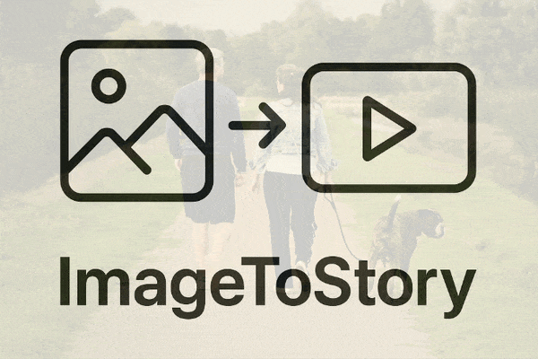
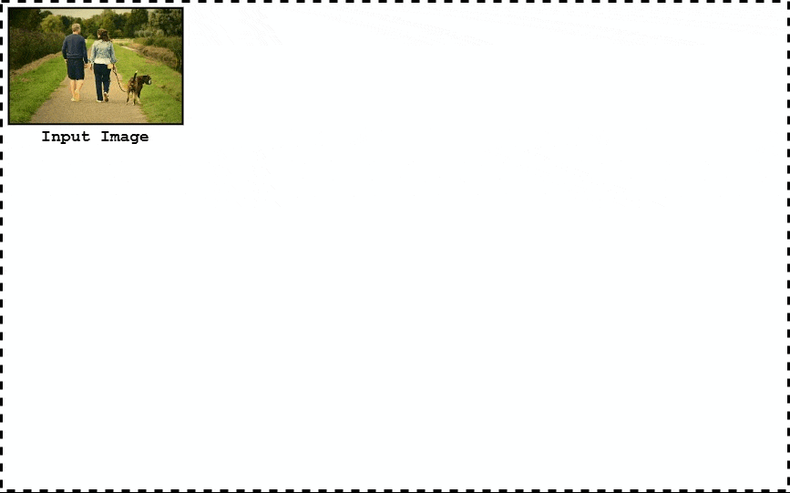

# Image To Story

Transform static images into engaging animated stories with AI-powered narration and visual effects.

## 🎯 Overview

ImageToStory is a Google Colab-based project that transforms static images into dynamic video stories by:
- Analyzing image contents using state-of-the-art computer vision models.
- Generating contextual narratives that describe the image elements.
- Creating smooth animations that highlight the keywords mentioned in the narration.
- Producing a final video that synchronizes visual animations with the generated story.

The overall pipeline is visualized in the diagram above. Beside the headers mentioned in the diagram, algorithmic snippets are injected in between these steps to harmonise and smooth-out the output.

## 🛠️ Technical Implementation

- **Visual Language Models (VLM)**: 
  - Image Captioning: [BLIP](https://huggingface.co/Salesforce/blip-image-captioning-base) (Bootstrapping Language-Image Pre-training).
  - Open-Vocabulary Object Detection: [OWLv2](https://huggingface.co/google/owlv2-base-patch16-ensemble) (Open-World Localization).
- **Natural Language Processing (NLP)**:
  - Keywords Identification: [spaCy](https://spacy.io/).
- **Speech Synthesis**:
  - [gTTS](https://pypi.org/project/gTTS/) (Google Text-To-Speech) for off-the-shelf narration.
  - [ElevenLabs](https://elevenlabs.io/docs/overview) for natural-sounding narration (Requires API key).
- **Animation Pipeline**:
  - [MoviePy](https://pypi.org/project/moviepy/) for video composition and generation.
  - [OpenCV](https://pypi.org/project/opencv-python/) and [Gizeh](https://github.com/Zulko/gizeh) for image processing.
  - Custom animation algorithms for smooth keyword highlighting.

## 🚀 Running The Code

1. Open the project in Google Colab (GPU runtime recommended): 
1. Run the two setup cell blocks in sequence:
   - `Environment Setup and Imports`
   - `Utility Functions`
1. Either upload your images to colab, or use image urls
1. Run the cells in the section `Inference`
1. Download the generated video from the Colab environment

Several parameters are exposed by the `image_to_story` function to allow customization of the output, such as:
- `max_dim`: This refers to the output video maximum dimension. It is recommended to use small values such as `480` to preview and test faster, and later increase it when generating the final output.
- `time_per_noun`: This allows the control of the time allocated for each keyword in the sentence. The higher this value, the longer the pauses between sentence parts.
- `mask_animation`: Can either be set to `None` (eliminating this animation), or `reveal` (generating a mask reveal effect).
- `background_animation`: Can either be set to `None`, `brightness`, `color` or `color-dim`. Experiment with these options to see their effect!
- `tts_library`: For better quality narration, it is recommended to set this parameter to `elevenlabs`. However doing so would also require setting the `elevenlabs_api_key`, which can be generated on the [ElevenLabs website](https://elevenlabs.io/docs/quickstart). Otherwise, the default value is `gtts` that uses the off-the-shelf Google Text-To-Speech module.

## 🎥 Examples

## 🚀 Next Steps

The next features I will be working on are:
- Adding move `mask_animation` options, such as a `paint-stroke` option allowing for the reveal of the subject via consecutive strokes of paint brush, or also a `splash` option that uses splashes of ink to reveal the subject.
- Handling keywords that are *plural*, in which case multiple objects could be detected, and should all be animated synchronously.

I would love to hear about any other ideas you might have to improve this project!

<!-- ## 🤝 Contributing

Contributions are welcome! Please feel free to submit a Pull Request. Note that all contributions should maintain compatibility with Google Colab. -->

## 📄 License

This project is licensed under the GNU GPLv3 License - see the [LICENSE](LICENSE) file for details.

---

Made with ❤️ by Joseph Assaker